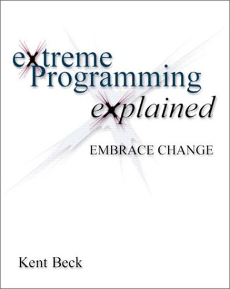
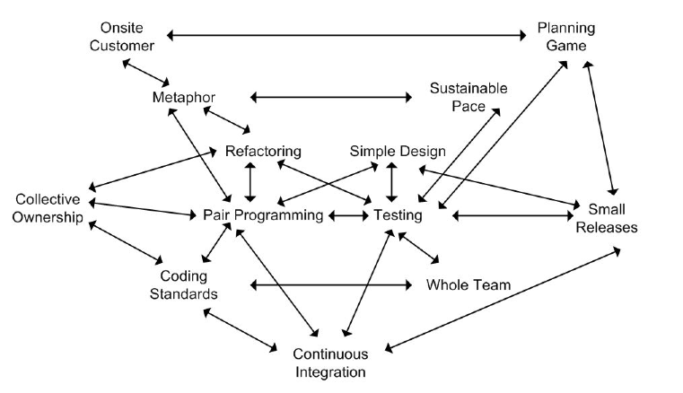
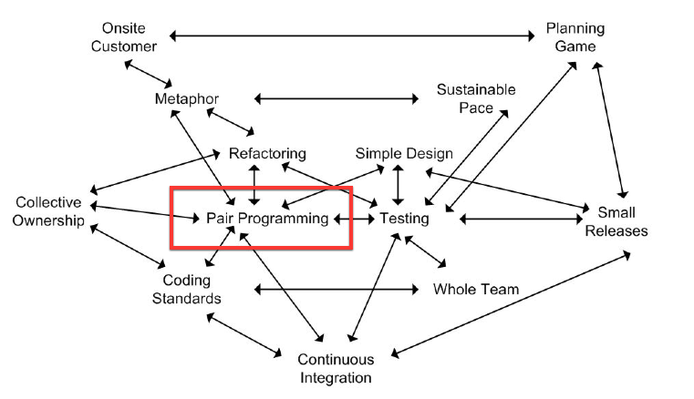

# Pair Programming

---

## Disclaimer

* Not a prescription
* Not a criticism
* Just our opinions

---

# Pair Programming

* What is it?
* Why we think it's a Good Thing™
* Why we sometimes find it hard to **start**
* Why we sometimes find it hard to **do**
* Q&A

^
- Please save any questions until the end

---

# What is Pair Programming?

---

## XP: The "White Book"

^
- I'm not sure of its exact origins, but I first came across the idea in Kent Beck's book about XP. If you haven't read it, I highly recommend reading it. I thought it would be interesting to quote some definitions from the book to see how he envisaged it.

---

> All production code is written with two people looking at one machine, with one keyboard and one mouse.

---

> There are two roles in each pair.

---

> One partner, the one with the keyboard and the mouse, is thinking about the best way to implement this method *right here*.

---

> The other partner is thinking *more strategically*.

^
- e.g. Is this whole approach going to work? What are some other test cases that might not work yet? Is there some way to simplify the whole system so the current problem just disappears?

---

> Pairing is *dynamic*.

^
- If two people pair in the morning, in the afternoon they might easily be paired with other folks.
- If you have responsibility for a task in an area that is *unfamiliar* to you, you might ask someone with *recent experience* to pair with you.
- More often, anyone on the team will do as a partner.

---

> A dialog between two people trying to simultaneously program.

---

> A conversation at many levels assisted by & focused on a computer.

---

> A subtle skill - you can spend the rest of your life getting good at.

---

## What Pair Programming is Not

---

> One person programming while another watches.

^
- Two people doing the job of one person.

---

> A one-way tutoring session.

---

> One person judging another.

^
- GFR

---

> Something only less experienced people do until they're up to speed.

^
- GFR

---

# Why we think pairing is a Good Thing™

---

## Benefits of pairing according to XP

^
- JM: A lot of why I think pairing is a good thing comes from my understanding of how XP is supposed to work. Here are the practices that XP is made up of.

---

### XP Practices (1-6)

* The Planning Game
* Small Releases
* Metaphor
* Simple Design
* Testing
* Refactoring

---

### XP Practices (7-12)

* Pair Programming
* Collective Ownership
* Continuous Integration
* 40-hour Week
* On-site Customer
* Coding Standards

^
- JM: Even if you don't know it you're already doing many of these

---

### XP Practices Supporting Pairing

---

> You can't possibly write all the production code in pairs. It will be too slow. What if two people don't get along?

---

* **Coding Standards**
* 40-hour Week
* Testing
* (Metaphor)
* Simple Design

^
- Help avoid discussion/argument over small inconsequential details.

---

* Coding Standards
* **40-hour Week**
* Testing
* (Metaphor)
* Simple Design

^
- If everyone is fresh and rested people are likely to be less grumpy and argumentative.

---

* Coding Standards
* 40-hour Week
* **Testing**
* (Metaphor)
* Simple Design

^
- Writing tests together helps align your understanding of the problem before tackling the implementation.

---

* Coding Standards
* 40-hour Week
* Testing
* (**Metaphor**)
* Simple Design

^
- We're not really doing this at FutureLearn but it might be a useful exercise to think about outside of this presentation.
- The pairs have the **metaphor** to ground their decisions about naming and basic design.

---

* Coding Standards
* 40-hour Week
* Testing
* (Metaphor)
* **Simple Design**

^
- The pairs are working within a simple design, so they can both understand what is going on.

---

> Then perhaps you *could* write all production code in pairs.

---

> Besides, if people program solo they are more likely to **make mistakes**, more likely to **overdesign**, and more likely **drop the other practices**, particularly under pressure.

---

### XP Practices Supported By Pairing

---

* **Simple Design**
* Testing
* Refactoring
* Collective Ownership
* Continuous Integration

^
- Pairing helps give you confidence that you've kept the system as simple as possible for the current requirements.

---

* Simple Design
* **Testing**
* Refactoring
* Collective Ownership
* Continuous Integration

^
- Pairing encourages you to do disciplined Test-Driven Development.

---

* Simple Design
* Testing
* **Refactoring**
* Collective Ownership
* Continuous Integration

^
- Pairing should give you the courage to tackle a tough refactoring and reduce the chance that you break the system.
- It should also encourage you to make changes to the system to keep it as simple as possible, to reduce duplication, and to better communicate the intent of the code.

---

* Simple Design
* Testing
* Refactoring
* **Collective Ownership**
* Continuous Integration

^
- Pairing should give you more confidence to change parts of the system that you're not familiar with.

---

* Simple Design
* Testing
* Refactoring
* Collective Ownership
* **Continuous Integration**

^
- With everyone pairing there is less un-integrated code at any given time and therefore less chance of merge conflicts.

---

### Mutually Supporting XP Practices

^
- We've discussed some of the practices enabled by pairing, and some of those that complement pairing. We'll now look at how all those practices come together in XP.

---

---

^
- It's not important to understand everything that's going on in this diagram, but it is important to note that Pair Programming is at the centre of the XP practices.

---

> The individual pieces are simple. The richness comes from the interactions of the parts.
-- Kent Beck

^
- Kent Beck sums this up nicely...
- [Any one practice doesn't stand well on its own. They require the other practices to keep them in balance.]

---

## Feedback Mechanisms in XP

---

^
- Talk about rapid feedback of pairing versus slow feedback of e.g. pull requests or even individuals committing master

---

## Benefits of pairing according to GFR

---

### Collective Code Ownership

* Develop a consistent shared:
    * coding style
    * design approach
    * architectural approach
    * domain model
    * ubiquitous language
    * culture

^
- Pairing helps collective code ownership work.
- Increase your Bus Factor.
- c.f. Coding Standard
- Everyone is empowered to change any part of the system at any time.
- If it's working you shouldn't be able to tell that an individual wrote a certain piece of the software - individual coding styles on a large code base are bad.
- Prevents silos of knowledge.

---

### Quality

* Helps catch edge cases
* Encourages discipline
* Continuous code review

^
- Pairing results in better quality code.
- "Turn the dial up to 10"
- Rate of new bugs.
- Cost of maintenance.
- Helps catch edge cases that might be missed when working alone.
- e.g. sticking to test-driven development and more likely to refactor.
- Is like a continuous code review giving rapid feedback.

---

### Efficiency

* Avoid going down rabbit holes
* Improved focus/flow
* On the job training

^
- Typing is not the bottleneck
- Helps avoid people ending up down unnecessary rabbit holes
- A more experienced person helping a less experienced person

---

### Simplicity

* Identify duplicate code
* Avoid over-engineering

^
- Makes it easier to spot common areas of code that you might be able to refactor

---

### Avoid people feeling afraid to ask for help

---

### Opportunities for inter-disciplinary collaboration

---

# Why we sometimes find it hard to start pairing

---

## I feel intimidated to work with someone more experienced

* *Nobody* knows what they're doing
* The impostor syndrome
    * "I'm just making stuff up as I go along"
    * "I'm going to be found out"
* The Dunning-Kruger effect
    * "There's so much that I don't know"
    * "Everyone here's a better programmer than I am"

---

## I don't want to disturb someone to ask them to pair

* Agree explicit rules about interruption for pairing
* Fixed pair rotation times e.g. every day/half-day
* No need for same pair to work on same story from beginning to end

---

## No other developer available to pair e.g. stuck in meetings

* Core pairing hours
* Doing more pairing ought to reduce the need for as many meetings
* Shorter more efficient meetings / make attendance voluntary
* Spike on something / refactor something

---

## I found my last pairing session hard work

* Be patient - pairing is a skill which takes time to learn
* Decide to try a new tactic
* Pair with someone different
* Encourage your colleagues to pair more often

^
- The more everyone pairs the easier it will get

---

## I feel like I need to pick up another story as soon as I finish one

* It’s better for the team if you:
  * Help someone else
  * Spend time refactoring code

---

# Why we sometimes find the process of pairing difficult

---

## Exhaustion / fatigue

* Take regular breaks

---

## Difficult to articulate thought processes

* Sketching on a whiteboard / piece of paper
* Pseudo code sketching

---

## No time for personal admin

* Don't try to pair all day

---

## Some types of task are hard to pair on e.g. writing commit notes/documentation

* Allow a single person to write and have the pair review it at the end

---

## One person hogs/avoids the keyboard

* Pairing ping-pong

---

## One person is distracted by email/IM notifications

* Switch off all distractions

---

## Differences in development environment e.g. editor, shell, OS

* Agree on a common development environment

---

## Physical environment not conducive to pairing

* Be prepared to move furniture (e.g. drawers)
* Make your pair feel comfortable
* Consider using two mirrored displays

---

# Summary

* Just our opinions
* Come up with an approach as a team
* Make that approach more explicit
* If you decide not to do any/much pair programming then how will you compensate?
* Working on a large long-lived codebase is not the same as working on a one-person project
* It's the job of the _team_ to deliver high quality software, not of any individual developer

---

# Q&A

---

# References

* http://www.extremeprogramming.org/
* http://codon.com/i-have-no-idea-what-im-doing
* http://en.wikipedia.org/wiki/Impostor_syndrome
* http://en.wikipedia.org/wiki/Dunning%E2%80%93Kruger_effect

---

---

# TODO

* Why we think pairing is a Good Thing™
  * Merge ideas/points from our Google Doc

* Why we sometimes find it hard to start/doing pairing
  * Use shorter headings
  * Use shorter bullet points
  * Move some of the text to notes
  * Progressively introduce points on slide
  * Talk about one point per slide

* Add initials next to notes to indicate who's going to say what
  * Maybe use square brackets to indicate things we're not going to say

* Summarise some of the lengthy notes/quotes we currently have

* The practices supported by pairing are probably more relevant/useful - it might be better to have these first or even delete the other ones.

* Come up with questions we can ask at the end to guage interest in pairing - do the team want to do more, less, the same?
