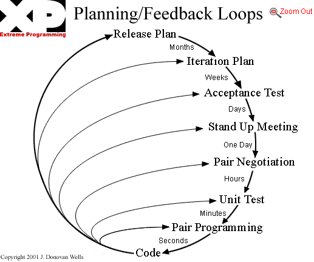

---

* A talk by Chris Roos & James Mead of Go Free Range Ltd
* Given at 2pm on 10th Feb, 2015 at FutureLearn's office

---

# Pair Programming

^
- *-> CJR
- Hi, we're Chris and James and we're going to talk to you about pair programming.

---

## Disclaimer

* Not a prescription
* Not a criticism
* Just our opinions

^
- We're not trying to tell you what to do.
- This is just what we think about pairing.

---

# Pair Programming

* What is it?
* Why we think it's important
* Why we think it's a Good Thing™
* Why we sometimes find it hard to **start**
* Why we sometimes find it hard to **do**
* Q&A

^
- *-> CJR
- This is what we're going to cover.
- [Read the bullet points]
- Please save any questions until the end.

---

# What is Pair Programming?

^
- *-> CJR
- Let's start by talking about what pair programming is and what it isn't.

---

## XP: The "White Book"

^
- We're not sure of its exact origins, but we first came across the idea in Kent Beck's book about Extreme Programming.
- If you haven't read it, we highly recommend reading it.
- We thought it would be interesting to quote some definitions from the book to see how Kent envisaged pairing.
- We've picked out half a dozen different quotes to help try to explain pairing.

---

> All production code is written with two people looking at one machine, with one keyboard and one mouse.
-- XP Explained

^
- The first one is... [Read the quote]
- This book was written at a time when it wasn't so easy to plug two keyboards into a single computer.
- We think the important thing here is that only one person is driving at any one time.

---

> There are two roles in each pair.
-- XP Explained

^
- [Read the quote]
- They're sometimes referred to as the driver and the navigator

---

> One partner, the one with the keyboard and the mouse, is thinking about the best way to implement this method *right here*.
-- XP Explained

^
- [Read the quote]
- This is the driver

---

> The other partner is thinking *more strategically*.
-- XP Explained

^
- [Read the quote]
- This is the navigator
- For example...
- Is this whole approach going to work?
- What are some other test cases that might not work yet?
- Is there some way to simplify the whole system so the current problem just disappears?

---

> Pairing is *dynamic*.
-- XP Explained

^
- [Read the quote]
- The book explains this by saying...
- If two people pair in the morning, in the afternoon they might easily be paired with other folks.
- If you have responsibility for a task in an area that is *unfamiliar* to you, you might ask someone with *recent experience* to pair with you.
- More often, anyone on the team will do as a partner.

---

> A dialog between two people trying to simultaneously program.
-- XP Explained

^
- Pairing is... [Read the quote]
- Obviously this doesn't mean that you're both trying to type at the same time, just that you're focussed on a single output.

---

> A conversation at many levels assisted by and focused on a computer.
-- XP Explained

^
- Pairing is... [Read the quote]

---

> A subtle skill - you can spend the rest of your life getting good at.
-- XP Explained

^
- And finally, pairing is... [Read the quote]
- We think this point is worth emphasising.
- Pairing can feel like it's something you're expected to be able to do just because you're a developer, but it's actually a skill that needs to be learnt like anything else.

---

## What Pair Programming is Not

^
- We've picked out a couple more quotes from the book and come up with one of our own to explain what pair programming is not.

---

> One person programming while another watches.
-- XP Explained

^
- [Read the quote]
- It's not a spectator sport - if there's no talking then you're not pairing.

---

> A one-way tutoring session.
-- XP Explained

^
- [Read the quote]
- Even if one person is more experienced than the other, the information flow shouldn't only be from the more experienced to the less experienced person.

---

> Something only less experienced people do until they're up to speed.

^
- We've observed pairing being used as an on-boarding tactic that's then dropped after the new hire is deemed to be up to speed.

---

# Why we think pairing is important

^
- *-> JEM
- A lot of why we think pairing is important comes from our understanding of how XP is supposed to work.
- We thought it would be useful to show you how pairing fits in with the other 11 XP practices.

---

## XP Practices (1-6)

* The Planning Game
* Small Releases
* Metaphor
* Simple Design
* Testing
* Refactoring

^
- Here are the first six practices that make up XP.
- [Read the list]

---

## XP Practices (7-12)

* Pair Programming
* Collective Ownership
* Continuous Integration
* 40-hour Week
* On-site Customer
* Coding Standards

^
- And here's the second six.
- [Read the list]
- It's not super important to know what all these mean at the moment, but it's worth noting that you're actually doing most of them.

---

## XP Practices Supporting Pairing

^
- We're going to start by looking at the practices that support pairing.

---

* Coding Standards
* 40-hour Week
* Testing
* (Metaphor)
* Simple Design

^
- These are the five practices that the book lists as supporting pairing.
- [Read the list]

---

* **Coding Standards**
* 40-hour Week
* Testing
* (Metaphor)
* Simple Design

^
- Coding Standards
- Help avoid discussion and argument over small inconsequential details.

---

* Coding Standards
* **40-hour Week**
* Testing
* (Metaphor)
* Simple Design

^
- 40-hour Week
- If everyone is fresh and rested people are less likely to be grumpy and argumentative.

---

* Coding Standards
* 40-hour Week
* **Testing**
* (Metaphor)
* Simple Design

^
- Testing
- Writing tests together helps align your understanding of the problem before tackling the implementation.

---

* Coding Standards
* 40-hour Week
* Testing
* (**Metaphor**)
* Simple Design

^
- Metaphor
- The book explains this by saying...
- "The pairs have the Metaphor to ground their decisions about naming and basic design."
- We don't really have this at FutureLearn but it's something that might be worth bearing in mind.

---

* Coding Standards
* 40-hour Week
* Testing
* (Metaphor)
* **Simple Design**

^
- Simple Design
- Having the simplest possible design makes it easier to communicate about making a change.

---

> Besides, if people program solo they are more likely to **make mistakes**, more likely to **over-design**, and more likely **drop the other practices**, particularly under pressure.
-- XP Explained

^
- Another quote from the book...
- [Read the quote]

---

## XP Practices Supported By Pairing

^
- Now we're going to look at the practices supported _by_ pairing.

---

* Simple Design
* Testing
* Refactoring
* Collective Ownership
* Continuous Integration

^
- These are the five practices that the book lists as being supported by pairing.
- [Read the list]

---

* **Simple Design**
* Testing
* Refactoring
* Collective Ownership
* Continuous Integration

^
- Simple Design
- Pairing helps give you confidence that you've kept the system as simple as possible for the current requirements.

---

* Simple Design
* **Testing**
* Refactoring
* Collective Ownership
* Continuous Integration

^
- Testing
- Pairing encourages you to do disciplined Test-Driven Development.

---

* Simple Design
* Testing
* **Refactoring**
* Collective Ownership
* Continuous Integration

^
- Refactoring
- Pairing should give you the courage to tackle a tough refactoring and reduce the chance that you break the system.
- It should also encourage you to make changes to the system to keep it as simple as possible, to reduce duplication, and to better communicate the intent of the code.

---

* Simple Design
* Testing
* Refactoring
* **Collective Ownership**
* Continuous Integration

^
- Collective Ownership
- Pairing should give you more confidence to change parts of the system that you're not familiar with.

---

* Simple Design
* Testing
* Refactoring
* Collective Ownership
* **Continuous Integration**

^
- Continuous Integration
- With everyone pairing there is less unintegrated code at any given time and therefore less chance of merge conflicts.

---

## Mutually Supporting XP Practices

^
- We've discussed some of the practices enabled by pairing, and some of those that complement pairing. We'll now look at how all those practices come together in XP.

---

---

^
- It's not important to understand everything that's going on in this diagram, but it is important to note that Pair Programming is at the centre of the XP process.

---

> The individual pieces are simple. The richness comes from the interactions of the parts.
-- Kent Beck

^
- Kent Beck sums this up nicely in a couple of places...
- [Read the quote]

---

> Any one practice doesn't stand well on its own. They require the other practices to keep them in balance.
-- Kent Beck

^
- [Read the quote]
- Given how central pairing is to the process, a question worth asking yourselves is:
- If you decide not to do much pair programming then how will you compensate?

---

## Feedback Mechanisms in XP

^ Something else that XP emphasises is trying to get rapid feedback and pairing is one way it achieves that.

---

^
- Pairing means you get much more rapid feedback than if you rely on pull requests, code reviews and the like.
- This diagram suggests that pair programming gives you feedback in a matter of seconds.
- Whereas we all know that pull requests might be in the order of hours or days.

---

# Why we think pairing is a Good Thing™

^
- *-> CJR
- Having talked a bit about why pairing's important, we're now going to outline some of the reasons that we think pairing is a good thing.

---

## Collective Code Ownership

* Shared understanding
* Empowering
* Avoid silos

^
- We think pairing helps collective code ownership work.
- Collective Code Ownership helps develop a consistent, shared : coding style, design approach, architectural approach, domain model, ubiquitous language, and culture.
- Working on a large long-lived codebase is not the same as working on a one-person project and you have to adapt the way you work.
- If it's working you shouldn't be able to tell that an individual wrote a particular bit of the software.
- Collective code ownership can also be described as everyone being empowered to change any part of the system at any time.
- Working this way prevents knowledge getting stuck in silos.

---

## Quality

* Helps catch edge cases
* Encourages discipline
* Continuous code review

^
- We think pairing results in better quality code.
- It helps catch edge cases that might be missed when working alone.
- It encourages discipline in that you're more likely to stick to test-driven development and more likely to refactor.
- It's like a continuous code review giving rapid feedback.

---

## Efficiency

* Avoid going down rabbit holes
* Improved focus
* On the job training

^
- We think pairing makes the _team_ more efficient
- It helps avoid people ending up down unnecessary rabbit holes.
- Continuous discussion about what you're doing keeps you focussed on the problem.
- Pairing is a way for a more experienced person to help a less experienced person.
- It's worth remembering that _typing_ is not the bottleneck

---

## Simplicity

* Identify duplicate code
* Avoid over-engineering

^
- We think pairing helps us develop a simpler system.
- Pairing makes it easier to spot common chunks of code that you might be able to refactor.
- The discipline of pairing helps avoid over-complicated solutions.

---

# Why we sometimes find it hard to start pairing

^
- *-> JEM
- So now we come on to some reasons why we sometimes find it difficult to _start_ pairing...

---

## I feel intimidated to work with someone more experienced

* *Nobody* knows what they're doing
* Impostor Syndrome
    * "I'm just making stuff up as I go along"
    * "I'm going to be found out"
* Dunning-Kruger Effect
    * "There's so much that I don't know"
    * "Everyone here's a better programmer than I am"

^
- [Read title]
- You shouldn't feel intimidated to work with someone more experienced, because they probably have similar insecurities as you.
- If you're interested in learning more about this then we can recommend Tom Stuart's talk: "I Have No Idea What I'm Doing"

---

## I don't want to disturb someone to ask them to pair

* Agree explicit rules
* Fixed pair rotation times
* Multiple pairs per story

^
- [Read title]
- We don't think you should ever feel as if you can't interrupt someone to ask to pair.
- But at the very least it's worth coming up with some explicit rules about when it's ok to do it.
- It makes it easier to find a new pair if everyone is changing pairs every day or half-day.
- It's easier to change pairs regularly if a pair doesn't feel it has to work on the same story from beginning to end.

---

## I can't find another developer to pair with

* Core pairing hours
* More pairing, less meetings
* Better meetings
* Spike / Refactor

^
- [Read title]
- We haven't tried it, but having specific hours of the day set aside for pairing might make it easier to find someone available to pair.
- We reckon that if the team is doing a lot of pairing there shouldn't be as much need to have as many meetings.
- Making meetings more efficient and making attendance voluntary might mean that people spend less time in meetings and are more available to pair.
- If you really can't find someone to pair with, we'd recommend that you spike on something or find something to refactor rather than starting work on a new story.

---

## I found my last pairing session hard work

* Patience
* Try a new tactic
* Someone else
* Encouragement to pair

^
- Be patient - pairing is a skill which takes time to learn.
- Make a conscious decision to try something new the next time you pair.
- Pair with someone different than last time.
- Encourage your colleagues to pair more often - the more _everyone_ pairs the easier it will get to pair.

---

## I feel like I ought to pick up another story as soon as I finish one

* Help someone else
* Spend time refactoring code

^
- We think that pressure isn't always healthy and there are advantages to keeping work-in-progress to a minimum.
- And so it's probably better _for the team_ to help someone else or spend time refactoring rather than start work on a new story.

---

# Why we sometimes find the process of pairing difficult

^
- *-> CJR
- Having talked about why we sometimes find it hard to _start_ pairing, we're now going to talk about the reasons why we sometimes find the _process_ of pairing hard.

---

## I find it tiring to pair

* Take regular breaks

^
- Pairing is tiring!
- Taking regular breaks can help keep you fresh. Aiming to take a break every 45 minutes sounds entirely reasonable to us.

---

## I find it difficult to articulate my thought processes

* Sketching on a whiteboard / piece of paper
* Pseudo code

^
- It can be difficult to put your thoughts into words, especially if it's something you've not been used to doing.
- Drawing a rough diagram for your pair often helps.
- Outlining a possible solution using pseudo code is another useful tactic.

---

## I need time for personal admin

* Don't try to pair all day
* Core pairing hours?

^
- Along with ensuring that you take regular breaks, you should probably avoid trying to pair for eight hours a day.
- Having the team agree on core pairing hours (you're expected to be free to pair between 11 and 4, for example) can help.

---

## I find it hard to pair on certain tasks

* Give your pair space to think/write

^
- e.g. Writing documentation or commit notes
- Constructing english sentences can be awkward to do as a pair.
- We find it's often better to allow one person to have a go at writing something and then the other person can review it and amend it if necessary.

---

## I find myself hogging/avoiding the keyboard

* Pairing ping-pong

^
- Ensure equal time spent driving by alternating between having one person write a failing test and the other trying to make the test pass.

---

## I find myself distracted by notifications

* Switch off **all** distractions
* Dedicated pairing machines

^
- It's amazing how distracting small things can be - the unread count in your email client or the changing colour of an icon indicating some unread messages somewhere.
- Use the regular breaks to catch up on things you've missed while pairing in your distraction free environment.
- Dedicated pairing machines wouldn't have personal email, instant messaging apps installed.

---

## I find it hard to work on other's machines

* Common development environment
* Dedicated pairing machines

^
- They might use a different editor, shell or OS, for example.
- These can cause an uneven playing field that make it hard for a pair to work effectively.
- Consider agreeing to a common baseline development environment, even if you don't use it when you're developing alone.
- Dedicated pairing machines make it easy to enforce a common development environment without having to encroach on a single developer's preferences.

---

## I find it physically uncomfortable to pair

* Be prepared to move furniture (e.g. drawers)
* Make your pair feel comfortable
* Consider using two mirrored displays

^
- It can be physically uncomfortable to pair if the furniture isn't set-up sensibly.
- Even though it may be your desk you need to ensure that both of you feel equally comfortable when driving.
- The use of two monitors with mirrored displays means you can both look at a monitor head on.

---

# Summary

* Just our opinions
* Pairing is hard but worthwhile
* Agree an approach as a team
* Make that approach more explicit

^
- *-> JEM
- We wanted to re-iterate that these are just our opinions.
- Pairing is definitely hard, or at least doing it well is hard, but we're convinced it pays off in the long run.
- The more you pair and the more your colleagues pair, the easier it will get.
- We'd recommend that you come up with an approach as a team, make that approach very explicit, stick to that approach for a while but keep evaluating how it's working.

---

# Q&A

^
- *-> CJR
- Any questions?

---

# References

* http://www.extremeprogramming.org/
* http://codon.com/i-have-no-idea-what-im-doing
